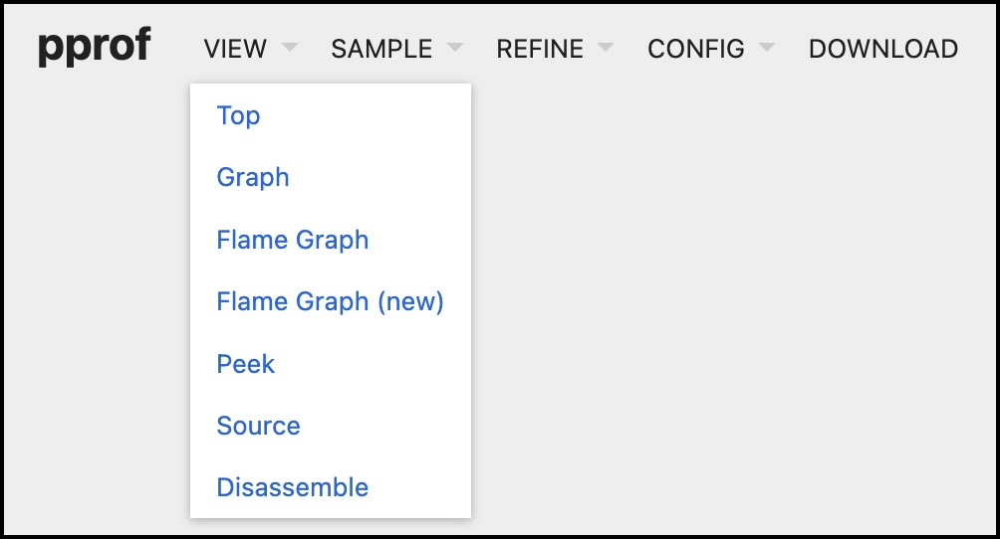
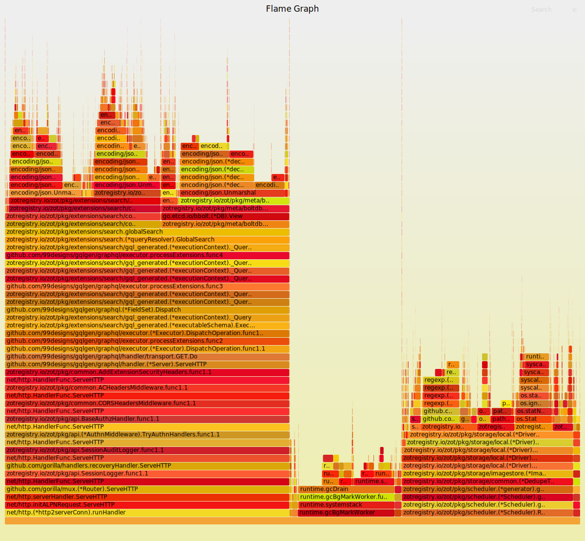
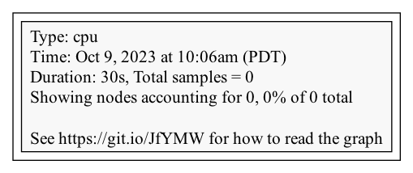

# Performance Profiling in zot

> :point_right: Use zot's built-in profiling tools to collect and analyze runtime performance.

The profiling capabilities within zot allow a zot [administrator](../articles/authn-authz.md) to collect and export a range of diagnostic performance data such as CPU intensive function calls, memory allocations, and execution traces. The collected data can then be analyzed using Go tools and a variety of available visualization tools.

> :pencil2: If authentication is enabled, only a zot admin user can access the APIs for profiling.
>
> :pencil2: All examples in this article assume that the zot registry is running at `localhost:8080`.

## What data is available?

The zot source code incorporates [golang's pprof package](https://pkg.go.dev/runtime/pprof) of runtime analysis tools to collect data for the following performance-related profiles:

| Profile  | Description |
| ------- | --------- |
| allocs | A sampling of all past memory allocations. |
| block | Stack traces that led to blocking on synchronization primitives. |
| cmdline | The command line invocation of the current program. |
| goroutine| Stack traces of all current goroutines. Use `debug=2` as a URL query parameter to export in the same format as an unrecovered panic. |
| heap | A sampling of memory allocations of live objects. You can specify the `gc` GET parameter to run GC before taking the heap sample. |
| mutex | Stack traces of holders of contended mutexes. |
| profile | CPU usage profile. You can specify the duration in the `seconds` URL query parameter. After receiving the profile file, use the `go tool pprof` command to investigate the profile. |
| threadcreate | Stack traces that led to the creation of new OS threads. |
| trace | A trace of execution of the current program. You can specify the duration in the `seconds` URL query parameter. After you get the trace file, use the `go tool trace` command to investigate the trace. |

To return a current HTML-format profile list along with a count of currently available records for each profile, use the following API command: 

    /v2/_zot/pprof/

> :pencil2: If authentication is enabled, only an admin user can access this API.

## How do I export profile data?

To collect and export any available profile, use the following API command format:

    /v2/_zot/pprof/<profile-type>[?<query-parameters>]

The following example shows an API request for the CPU usage profile named `profile` using a collection window of 30 seconds:

    $ curl -s http://localhost:8080/v2/_zot/pprof/profile?seconds=30 > cpu.prof

This command example creates an output data file named "cpu.prof".

- The query parameter `?seconds=<number>` specifies the number of seconds to gather the profile data. If this parameter is not specified, the default is 30 seconds.
- In this example, the raw output data is redirected to a file named "cpu.prof". Alternatively, you can use `curl -O` to create a file with the default profile name (in this case, "profile"). If no output file is specified by either a cURL flag or an output redirection, the cURL command fails with "Failure writing output to destination". 
- The command output file is in a machine-readable format that can be interpreted by performance analyzers.

## Analyzing the CPU usage profile using `go tool pprof`

Go's pprof package provides a variety of presentation formats for analyzing runtime performance.

For detailed information, see the [pprof documentation](https://pkg.go.dev/runtime/pprof).

### Generating a pprof web presentation

When an HTTP port is specified as a command flag, the `go tool pprof` command installs and opens a local web server that provides a web interface for viewing and analyzing the profile data.  This example opens a localhost page at port 9090 for viewing the CPU usage data captured in the profile file named "cpu.prof". 

    $ go tool pprof -http=:9090 cpu.prof
    Serving web UI on http://localhost:9090

The pprof web view offers several options for viewing and interpreting the collected performance data.  Select VIEW to see the available options:

{width="300"}

A Flame Graph can be very useful for analyzing CPU usage:

{width="300"}

### Generating a graphic image

The pprof package can generate graphic representations of profile data in many formats. This example generates a PNG file representing the CPU usage in the "cpu.prof" file.

    $ go tool pprof -png cpu.prof
    Generating report in profile001.png

{width="300"}

### Opening a pprof interactive session

This example opens an interactive session with pprof and executes the pprof `top` command, which displays the top ten modules by CPU usage during the profiling capture window.

    $ go tool pprof cpu.prof
    Type: cpu
    Time: Sep 26, 2023 at 10:01am (PDT)
    Duration: 30s, Total samples = 10ms (  0.1%)
    Entering interactive mode (type "help" for commands, "o" for options)
    (pprof) top
    Showing nodes accounting for 10ms, 100% of 10ms total
        flat  flat%   sum%        cum   cum%
        10ms   100%   100%       10ms   100%  runtime.pthread_cond_signal
            0     0%   100%       10ms   100%  runtime.findRunnable
            0     0%   100%       10ms   100%  runtime.mcall
            0     0%   100%       10ms   100%  runtime.notewakeup
            0     0%   100%       10ms   100%  runtime.park_m
            0     0%   100%       10ms   100%  runtime.runSafePointFn
            0     0%   100%       10ms   100%  runtime.schedule
            0     0%   100%       10ms   100%  runtime.semawakeup
    (pprof)

## Analyzing the trace profile using `go tool trace`

You can collect trace data with the `trace` profile, as in this example:

      $ curl -s -v http://localhost:8080/v2/_zot/pprof/trace?seconds=30 > trace.prof

Using the `go tool trace` package, you can analyze the trace data captured in the "trace.prof" example file:

    $ go tool trace trace.prof
    2023/09/21 16:58:58 Parsing trace...
    2023/09/21 16:58:58 Splitting trace...
    2023/09/21 16:58:58 Opening browser. Trace viewer is listening on http://127.0.0.1:62606

The `go tool trace` command installs and opens a local web server that provides a web interface for viewing and analyzing the trace data.

As an alternative, you can generate a pprof-like profile from the trace file using the following command:

    $ go tool trace -pprof=[net|sync|syscall|sched] <filename>

For example:

    $ go tool trace -pprof=net trace.prof

