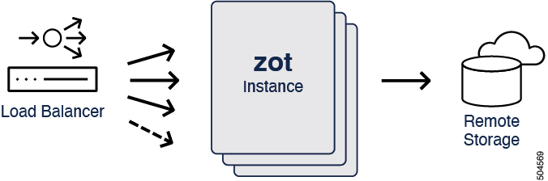

# Scaling zot

For cases where there are a large number of images and/or a high request-rate to zot, zot supports a few features for scaling compute and storage to address performance.
The overall workload can be shared by a "cluster" of zot instances.

> :point_right: There are 2 approaches to scale-out - scaling only compute and scaling both compute and storage. The article goes into more details about both these approaches.

## How is this different from high availability?

High Availability ensures fault-tolerance and no service impact if zot instances go offline or if the storage is offline.

In scale-out, a zot instance going offline or storage going offline will impact service availability unlike in the high-availability case.

See the [High Availability article](./high-availability.md) for more information.

## How it works

Each repo is served by one zot instance, and that instance is solely responsible for serving all images of that repo. A repo in storage can be written to only by the zot instance responsible for that repo.

> :point_right: zot's built-in scale-out cluster functionality is available from zot release v2.1.0 and later. For details on how to achieve a similar functionality for earlier releases of zot, use the version selector at the top of the page to navigate to your release version and see the [clustering article](./clustering.md).

When a zot instance in the cluster receives an image push or pull request for a repo, the receiving instance hashes the repo path and consults a hash table to determine which instance is responsible for the repo.

- If the hash indicates that another instance is responsible, the receiving instance forwards the request to the responsible instance and then acts as a proxy, returning the response to the requestor.
- If the hash indicates that the current (receiving) instance is responsible, the request is handled locally.

> :information_source: For better resistance to collisions and preimage attacks, zot uses SipHash as the hashing algorithm.

## Compute-only scale-out

In this approach, all zot instances share the same cache and storage.

### Prerequisites

The following conditions must be met:

- All zot instances use a shared cache and a shared S3-compatible storage. There is no local caching in the zot instances.
- Each zot instance in the cluster has its own IP address.
- For convenience, zot should also be running on the same port on all the instances.

### Configuration examples

In the zot configuration, each instance must have a list of its peers configured in the "members" section of the JSON structure including itself. This is a list of reachable addresses or hostnames. Each instance owns one of these addresses.

> :pencil2: The ordering of peers in the members list must be configured in the same way on all the zot instances.

The instance must also have a hash key for hashing the repo path of the image request and a TLS certificate for authenticating with its peers.

#### Registry only (no UI)

In this example, a zot cluster is configured to be used as a registry only. The UI is not enabled. All zot instances share a common S3 storage config and a common cache driver.

<details>
  <summary markdown="span">Click here to view a sample cluster configuration for each instance. See the "cluster" section in the JSON structure. All instances use a DynamoDB cache driver.</summary>

```json
{
  "distSpecVersion": "1.1.0",
  "storage": {
    "rootDirectory": "/tmp/zot",
    "dedupe": false,
    "remoteCache": true,
    "storageDriver": {
      "name": "s3",
      "rootdirectory": "/zot",
      "region": "us-east-1",
      "regionendpoint": "localhost:4566",
      "bucket": "zot-storage",
      "secure": false,
      "skipverify": false
    },
    "cacheDriver": {
      "name": "dynamodb",
      "endpoint": "http://localhost:4566",
      "region": "us-east-1",
      "cacheTablename": "ZotBlobTable",
      "repoMetaTablename": "ZotRepoMetadataTable",
      "imageMetaTablename": "ZotImageMetaTable",
      "repoBlobsInfoTablename": "ZotRepoBlobsInfoTable",
      "userDataTablename": "ZotUserDataTable",
      "versionTablename": "ZotVersion",
      "apiKeyTablename": "ZotApiKeyTable"
    }
  },
  "http": {
    "address": "0.0.0.0",
    "port": "9000",
    "tls": {
      "cert": "test/data/server.cert",
      "key": "test/data/server.key"
    }
  },
  "log": {
    "level": "debug"
  },
  "cluster": {
    "members": [
      "zot-server1:9000",
      "zot-server2:9000",
      "zot-server3:9000"
    ],
    "hashKey": "loremipsumdolors",
    "tls": {
      "cacert": "test/data/ca.crt"
    }
  }
}
```

</details>

<details>
  <summary markdown="span">Click here to view a sample cluster configuration for each instance. See the "cluster" section in the JSON structure. All instances use the Redis cache driver.</summary>

```json
{
  "distSpecVersion": "1.1.0",
  "storage": {
    "rootDirectory": "/tmp/zot",
    "dedupe": false,
    "remoteCache": true,
    "storageDriver": {
      "name": "s3",
      "rootdirectory": "/zot",
      "region": "us-east-1",
      "regionendpoint": "localhost:4566",
      "bucket": "zot-storage",
      "secure": false,
      "skipverify": false
    },
    "cacheDriver": {
        "name": "redis",
        "url": "redis://localhost:6379",
        "keyprefix": "zot"
    },
  },
  "http": {
    "address": "0.0.0.0",
    "port": "9000",
    "tls": {
      "cert": "test/data/server.cert",
      "key": "test/data/server.key"
    }
  },
  "log": {
    "level": "debug"
  },
  "cluster": {
    "members": [
      "zot-server1:9000",
      "zot-server2:9000",
      "zot-server3:9000"
    ],
    "hashKey": "loremipsumdolors",
    "tls": {
      "cacert": "test/data/ca.crt"
    }
  }
}
```

</details>

### Using zot web UI and zli in a scale-out cluster

To use zot's web UI or `zli`, all the zot instances in the cluster must also share session information.

In zot release version v2.1.9 and newer, zot supports configuring an external Redis-compatible session storage which can be shared by the instances. For releases prior to this, a load balancer such as [HAProxy](https://www.haproxy.com/) can be used to set a sticky session cookie.

#### Configuration Example - Registry with UI enabled

In this example, a zot cluster is configured with UI enabled. All zot instances share a common S3 storage config, a common Redis cache driver, and a common Redis-compatible session storage.

> :point_right: zot's built-in support for external session storage is available from zot release v2.1.9 and newer. For earlier versions of zot, a single entry point load-balancer such as HAProxy can be used to set a sticky session cookie.

<details>
  <summary markdown="span">Click here to view a sample cluster configuration with UI enabled for each instance.</summary>

```json
{
  "distSpecVersion": "1.1.0",
  "storage": {
    "rootDirectory": "/tmp/zot",
    "dedupe": false,
    "remoteCache": true,
    "storageDriver": {
      "name": "s3",
      "rootdirectory": "/zot",
      "region": "us-east-1",
      "regionendpoint": "localhost:4566",
      "bucket": "zot-storage",
      "secure": false,
      "skipverify": false
    },
    "cacheDriver": {
        "name": "redis",
        "url": "redis://localhost:6379",
        "keyprefix": "zot"
    },
  },
  "http": {
    "address": "0.0.0.0",
    "port": "9000",
    "tls": {
      "cert": "test/data/server.cert",
      "key": "test/data/server.key"
    },
    "auth": {
      "htpasswd": {
        "path": "/tmp/zotpasswd"
      },
      "sessionDriver": {
        "name": "redis",
        "url": "redis://localhost:6379",
        "keyprefix": "zotsession"
      }
    }
  },
  "log": {
    "level": "debug"
  },
  "cluster": {
    "members": [
      "zot-server1:9000",
      "zot-server2:9000",
      "zot-server3:9000"
    ],
    "hashKey": "loremipsumdolors",
    "tls": {
      "cacert": "test/data/ca.crt"
    }
  },
  "extensions": {
    "search": {
      "enable": true
    },
    "ui": {
      "enable": true
    }
  }
}
```

</details>

For older releases of zot that do not support external session storage, a load balancer can set sticky sessions.

<details>
  <summary markdown="span">Click here to view a sample HAProxy configuration with sticky session cookie</summary>

```

global
        log /dev/log    local0
        log /dev/log    local1 notice
        chroot /var/lib/haproxy
        maxconn 2000
        stats timeout 30s

defaults
        log     global
        mode    tcp
        option  tcplog
        option  dontlognull
        timeout connect 5000
        timeout client  50000
        timeout server  50000

frontend zot
    bind *:8080
    default_backend zot-cluster

backend zot-cluster
    mode http
    balance roundrobin
    cookie SERVER insert indirect nocache
    server zot-server1 127.0.0.1:9000 check cookie zot-server1
    server zot-server2 127.0.0.2:9000 check cookie zot-server2
    server zot-server3 127.0.0.3:9000 check cookie zot-server3

```

</details>

## Compute and Storage scale-out

In a typical case, the S3-compatible storage that all the zot instances use should be able to scale along with the number of zot instances. However, there is a supported deployment configuration of a scale-out cluster where the cache and storage is local to the individual zot instances.

> :material-alert: In this deployment, use of the UI is not supported.

### Sample Configuration

<details>
  <summary markdown="span">Click here to view a sample cluster configuration for each instance.</summary>

```json
{
  "distSpecVersion": "1.1.0",
  "storage": {
    "rootDirectory": "/tmp/zot"
  },
  "http": {
    "address": "0.0.0.0",
    "port": "9000",
    "tls": {
      "cert": "test/data/server.cert",
      "key": "test/data/server.key"
    }
  },
  "log": {
    "level": "debug"
  },
  "cluster": {
    "members": [
      "zot-server1:9000",
      "zot-server2:9000",
      "zot-server3:9000"
    ],
    "hashKey": "loremipsumdolors",
    "tls": {
      "cacert": "test/data/ca.crt"
    }
  }
}
```

</details>

## Sending client traffic to the zot cluster

Either of the following two schemes can be used to reach the cluster.

### Using a single entry point load balancer

{width="500"}

When a single entry point load balancer such as [HAProxy](https://www.haproxy.com/) is deployed, the number of zot instances can easily be expanded by simply adding the IP addresses of the new instances in the load balancer configuration.

When the load balancer receives an image push or pull request for a repo, it forwards the request to any instance in the cluster. No repo-specific programming of the load balancer is needed because the load balancer does not need to know which instance owns which repo. The instances themselves can determine this.

### Using DNS-based load balancing

Because the scale-out architecture greatly simplifies the role of the load balancer, it may be possible to eliminate the load balancer entirely. A scheme such as [DNS-based routing](https://coredns.io/plugins/loadbalance/) can be implemented, exposing the zot instances directly to the clients.

> :point_right: If sticky session cookies are required, this approach may not be suitable.

## When an instance fails

The scale-out clustering scheme described in this article is not self-healing when an instance fails. In case of an instance failure, only those repositories that are mapped to the failed instance are affected. If the error is not transient, the cluster must be resized and restarted to exclude that instance.

## CVE repository in a zot cluster environment

CVE scanning is not supported for cloud deployments. In the scale-out clustering scheme described in this article, CVE scanning is disabled. In this case, we recommend implementing a CVE repository with a zot instance outside of the cluster using a local disk for storage and [Trivy](https://trivy.dev/) as the detection engine.

## Trust extension

The trust extension functionality depends on a shared directory under the zot root directory for storing files. For this reason, the trust extension is also not supported in the scale-out scenario.

## Registry sync

The [sync](./mirroring.md) feature of zot, either on demand or periodic, is compatible with scale-out clustering. In this case, the repo names are hashed to a particular instance and only that instance will perform the sync.
