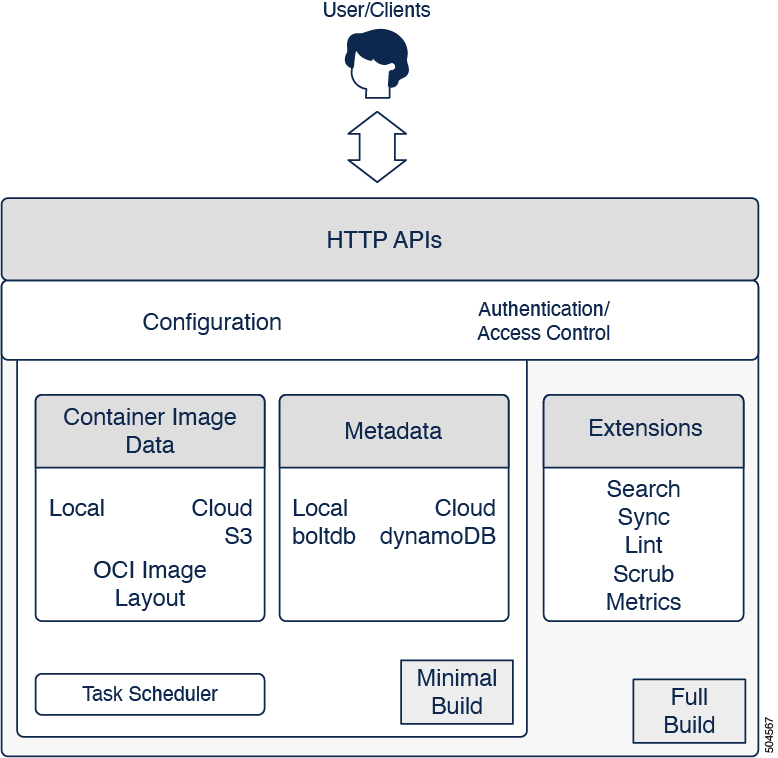

# Architecture

> `zot` is an OCI-native container image registry. This document discusses the design goals, the overall architecture, and the design choices made in the implementation of the design goals.

## Design Goals

### OCI-first

-   HTTP APIs strictly conforms to the [OCI Distribution
    Specification](https://github.com/opencontainers/distribution-spec)

    `zot` intends to be a **production** reference implementation for the
    OCI Distribution Specification. In fact, `zot` does not support any
    other vendor protocol or specification.

-   Storage layout follows the [OCI Image
    Specification](https://github.com/opencontainers/image-spec)

    The default and only supported storage layout is the OCI Image
    Layout. The implications of this choice are that any OCI image
    layout can be served by `zot` and conversely, `zot` converts data
    on-the-wire into an OCI image layout.

### Single binary model

`zot` is a single binary image with all features included so that deployment is extremely simple in various environments, including bare-metal, cloud, and embedded devices. Behavior is controlled by a single configuration file.

### Enable Only What You Need

A clear separation exists between (1) the core OCI-compliant HTTP APIs and storage functionality, and (2) other add-on features modeled as **extensions**. The extension features can be selectively enabled both at build-time and run-time.

For more information, see "Conditional Builds" in `zot`'s[Security Posture](kb:security-posture.xml#_conditional_builds) document.

## Overall Architecture

As shown in the following figure, the architecture of zot is organized as: 

    zot-full = zot-minimal + extensions

{width="400"}

The minimal build is the core OCI-compliant registry functionality as described by the [OCI Distribution Specification](https://github.com/opencontainers/distribution-spec). 

The full build adds features that are not a part of the Distribution Specification, but are allowed to be added as [Extensions](https://github.com/opencontainers/distribution-spec/tree/main/extensions). 

### Interaction

External interaction with `zot` consists of the following two types:

-   Client-initiated data or meta-data queries

-   Admin-initiated configuration

All client-side interaction occurs over HTTP APIs. The core data path queries are governed by the [OCI Distribution Specification](https://github.com/opencontainers/distribution-spec). All additional meta-data queries are handled based on the setting of the `search` extension:

-   If the `search` extension is enabled, enhanced registry searching
    and filtering is supported, using graphQL. A database is maintained
    by `zot` to efficiently answer complex queries on data stored in the
    database.

-   If the `search` extension is not enabled, basic queries are
    supported using the core APIs. These queries are less efficient and
    search actual storage, which is limited in content.

### Configuration

A single configuration file governs `zot` instance behavior. An exception can be made for security concerns, wherein configuration items containing sensitive credentials can be stored in separate files referenced by the main configuration file. Using separate files allows stricter permissions to be enforced on those files if stored locally. Also, modeling as external files allows for storing [Kubernetes Secrets](https://kubernetes.io/docs/concepts/configuration/secret/).

The configuration file is divided into sections for `http`, `storage`, `log`, and `extension`, governing the behavior of the respective components.

### Authentication and Authorization

A robust set of authentication and authorization options are supported natively in `zot`. These controls are enforced before access is allowed into the storage layer.

For more information, see [User Authentication and Authorization with zot](kb:authn-authz.xml).

### Storage Driver Support

`zot` supports any modern local filesystem. Remote filesystems, such as AWS S3 or any AWS S3-compatible storage system, are supported. Additional driver support is planned in the roadmap.

> **Note:**
> Deduplication is supported for both local and remote filesystems, but deduplication requires a filesystem with hard-link support.

For more information, see [Storage Planning with zot](kb:storage.xml).

### Security Scanning

`zot` integrates with the [`trivy`](https://github.com/aquasecurity/trivy) security scanner to scan container images for vulnerabilities. The database is kept current by periodically downloading any vulnerability database updates at a configurable interval. The user remains agnostic of the actual scanner implementation, which may change over time.

### Extensions

Additional registry features that are not a part of the Distribution Specification are added as [Extensions](https://github.com/opencontainers/distribution-spec/tree/main/extensions).  

> **Note:**
> Extension features of `zot` are available only with a full `zot` image. They are not supported in a minimal `zot` image.

For more information about extensions, see [*Extensions*](extensions.md).

### Background Tasks

Several periodic tasks occur in the registry, such as garbage collection, sync mirroring, and scrubbing. A task scheduler handles these tasks in the background, taking care not to degrade or interrupt foreground tasks running in the context of HTTP APIs.
