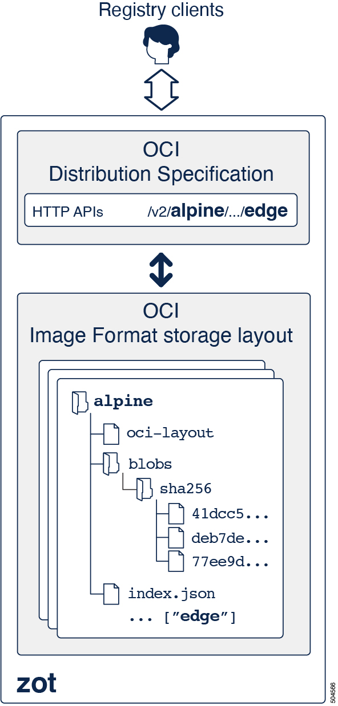

# Concepts

## What is zot?

> :point_right: **zot** is a production-ready, open-source, vendor-neutral container image registry server based purely on OCI standards.

Two broad trends are changing how we build, distribute, and consume
software. The first trend is the increasing adoption of container
technologies. The second trend is that software solutions are being
composed by combining elements from various sources rather than being
built entirely from scratch. The latter trend raises the importance of
software provenance and supply chain security. In both trends, zot
intends to play an important role by providing a production-ready,
open-source, vendor-neutral container image registry server based purely
on OCI standards.

### What is an OCI image registry?

An OCI image registry is a server-based application that allows you to
store, manage, and share container images. A developer uploads (pushes)
an image to the registry for distribution. Users can then download
(pull) the image to run on their systems. The [OCI Distribution
Specification](https://github.com/opencontainers/distribution-spec),
published by the Open Container Initiative (OCI), defines a standard API
protocol for these and other image registry operations.

An image registry can be a part of your continuous integration and
continuous deployment (CI/CD) pipeline when you host zot on your
public or private server. In its minimal form, you can also embed a
zot registry in a product. In either case, zot provides a secure
software supply chain for container images.

## Why zot?

> :point_right: zot = OCI Distribution Specification + OCI Image Format

At its heart, zot is a production-ready, vendor-neutral OCI image
registry with images stored in the OCI image format and with the OCI
distribution specification on-the-wire. zot is built for developers by
developers, offering features such as minimal deployment using a single
binary image, built-in authentication and authorization, and inline
garbage collection and storage deduplication.

{width="300"}

Some of the principal advantages of zot are:

-   Open source

-   OCI standards-only both on-the-wire and on-disk

-   Clear separation between core distribution spec and zot-specific
    extensions

-   Software supply chain security, including support for
    [cosign](http://github.com/sigstore/cosign) and
    [notation](http://github.com/notaryproject)

-   Security hardening

-   Single binary with many features built-in

-   Suitable for deployments in cloud, bare-metal, and embedded devices

zot fully conforms to the [OCI Distribution
Specification](https://github.com/opencontainers/distribution-spec).

The following table lists additional advantages of zot:

|                                   |               |
|-----------------------------------|--------------------|
| **Distribution Spec conformance** | yes                |
| **CNCF project**                  | accepted as a Sandbox Project |
| **License**                       | Apache 2.0         |
| **On-premise deployment**         | yes                |
| **OCI conformance**\*             | yes                |
| **Single binary image**\*         | yes                |
| **Minimal build**\*               | yes                |
| **Storage Layout**                | OCIv1 Image Layout |
| **Authentication**                | built-in           |
| **Authorization**                 | built-in           |
| **Garbage collection**            | inline             |
| **Storage deduplication**         | inline             |
| **Cloud storage support**         | yes                |
| **Delete by tag**                 | yes                |
| **Vulnerability scanning**        | built-in           |
| **Command line interface (cli)**  | yes                |
| **UI**                            | yes                |
| **External contributions**    | beta available     |
| **Image signatures**              | built-in           |

> :pencil2:
> \* The **minimal build** feature is the ability to build a minimal
Distribution Spec compliant registry in order to reduce library
dependencies and the possible attack surface.
