# Use the Web Interface to Find Images

> :point_right: Using a browser, you can browse a **zot** repository for container images and artifacts. The web interface also provides the commands for downloading an image using popular third-party tools.

If a zot registry is built with the optional `zui` package, the registry has a web interface. 

## Access the registry

> :pencil2: Depending on the security configuration of the zot registry, you might need to authenticate before being given access.

The initial page of the registry displays a sampling of the most popular images and recently updated images. To view all available images in the registry, click the `View all` link in the upper right of the page to go to the `/explore` page. 

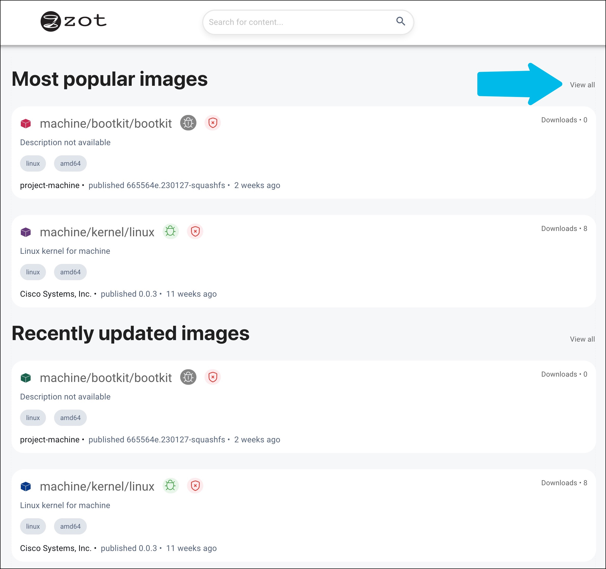{width="600"}

> :bulb: Wherever an image name appears, two icons follow the name, indicating the results of the vulnerability scan and the signature status. These icons are described in [Icons and their meanings](#icons).

## Find an image

To assist you in finding images specific to your requirements, the `/explore` page provides several sorting options along with faceted navigation in addition to a general search box.

- Sorting criteria include relevance, most recently updated, alphabetical, and most downloaded.

- Navigation facets include operating system, CPU architecture, and signature status.

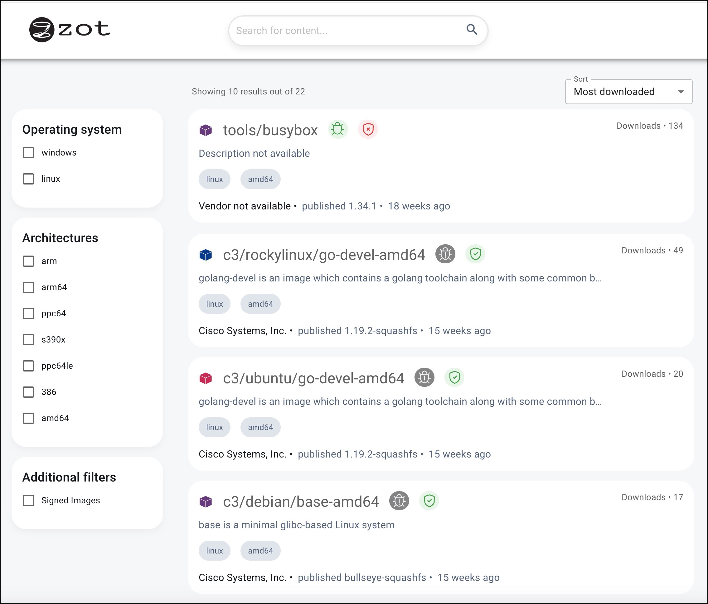{width="600"}

[//]: # (This is a Markdown comment)

When you locate the desired image, click its tile.

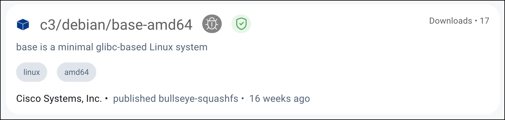{width="400"}

## Inspect the image properties

The `OVERVIEW` tab of the initial image description page contains a brief description of the image along with several details, such as the repository URL, number of downloads, last published, size, and license type.

Click the `TAGS` tab to view the available versions of the image.

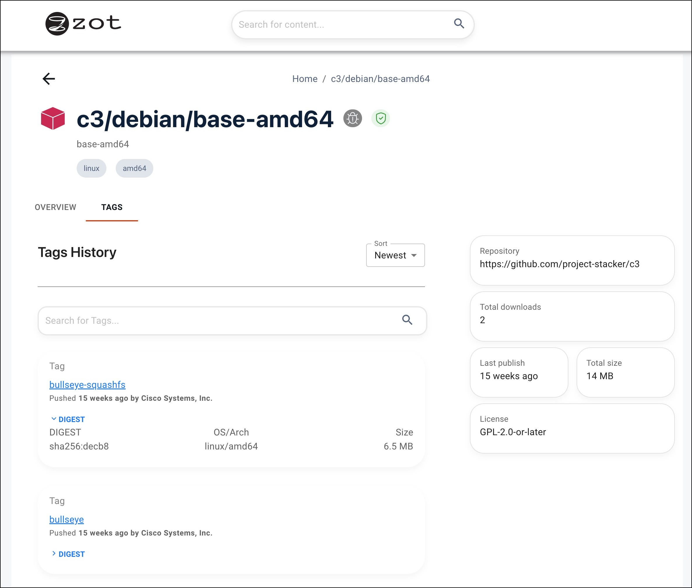{width="600"}

Click the tag link of the desired version of the image. In the resulting page, you can view detailed information about the image, including its digest hash, and you can obtain a command to pull the image from the repository.

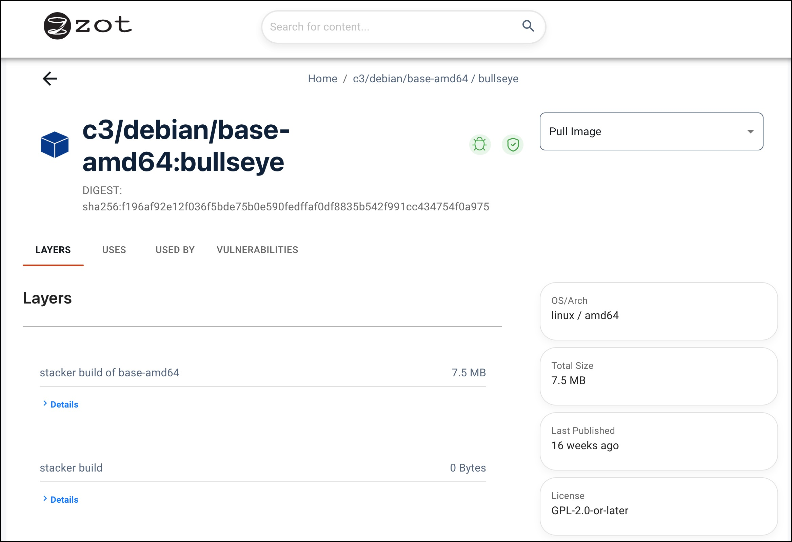{width="600"}

Tabs on this page provide the following information:

| Tab | Description |
| ---- | ----------- |
| LAYERS | The build command and the digest hash |
| USES | A list of images used by this image |
| USED BY | A list of images that use this image |
| VULNERABILITIES | A list of known vulnerabilities |

From the `LAYERS` tab, click `Details` to view an example of the image build command and the layer's digest hash.

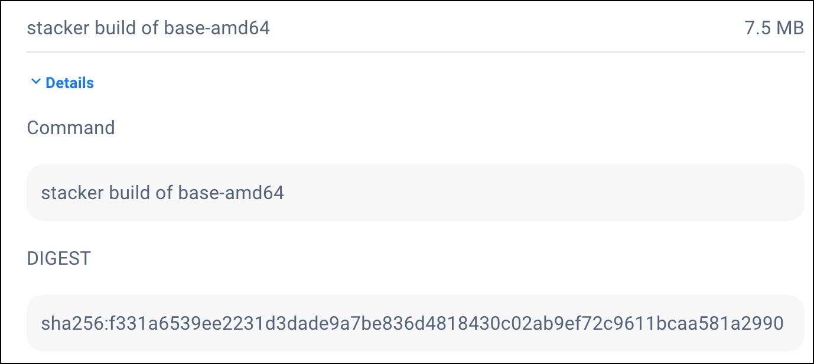{width="400"}

## Pull an image

After opening the tag link of the desired image, click the `Pull Image` drop-down list to display the available pull commands. Docker, podman, and skopeo image management tools are supported. 

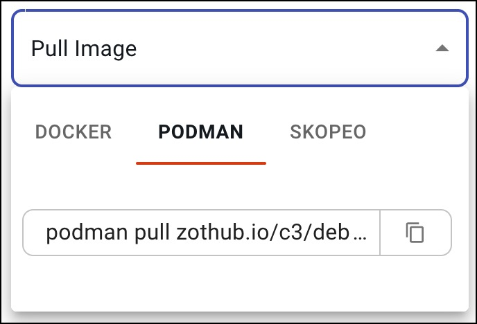{width="200"}

Select a tool and click the pages icon next to the command to copy the full command to your clipboard. An example of the pull command using podman is:

`podman pull zothub.io/c3/debian/base-amd64:bullseye`

Paste the pull command into your terminal to pull the image.

> :bulb: For information about using image management tools to pull images, see [Push and Pull Image Content](user-guide-datapath.md).

## Adding Bookmarks

To mark an image so that it can be easily found later, click the bookmark icon on the image page. Bookmarked images appear in search queries when the Bookmarked option is enabled.

The bookmark icon before selection:

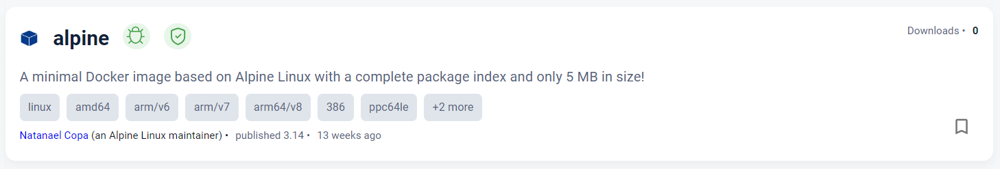{width="600"}

The bookmark icon after selection:

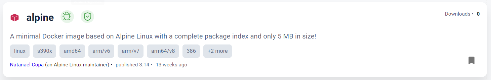{width="600"}

## Icons and their meanings

These icons appear next to the image name, indicating the results of the vulnerability scan and the signature status. 

| Icon | Description |
| ---- | ----------- |
| 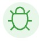{width="35"} | A vulnerability scan of the image found no vulnerabilities | 
| 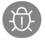{width="35"} | A vulnerability scan of the image failed (See severity icon in VULNERABILITIES tab) | 
| &nbsp;&nbsp;&nbsp;&nbsp;&nbsp;{width="25"} | Critical severity | 
| &nbsp;&nbsp;&nbsp;&nbsp;&nbsp;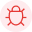{width="25"} | High severity | 
| &nbsp;&nbsp;&nbsp;&nbsp;&nbsp;{width="25"} | Medium severity | 
| &nbsp;&nbsp;&nbsp;&nbsp;&nbsp;{width="25"} | Low severity | 
| {width="35"} | The image signature is verified | 
| 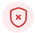{width="35"} | The image signature is not verified | 
| {width="25"} | The image is not bookmarked by the user | 
| {width="25"} | The image is bookmarked by the user | 
